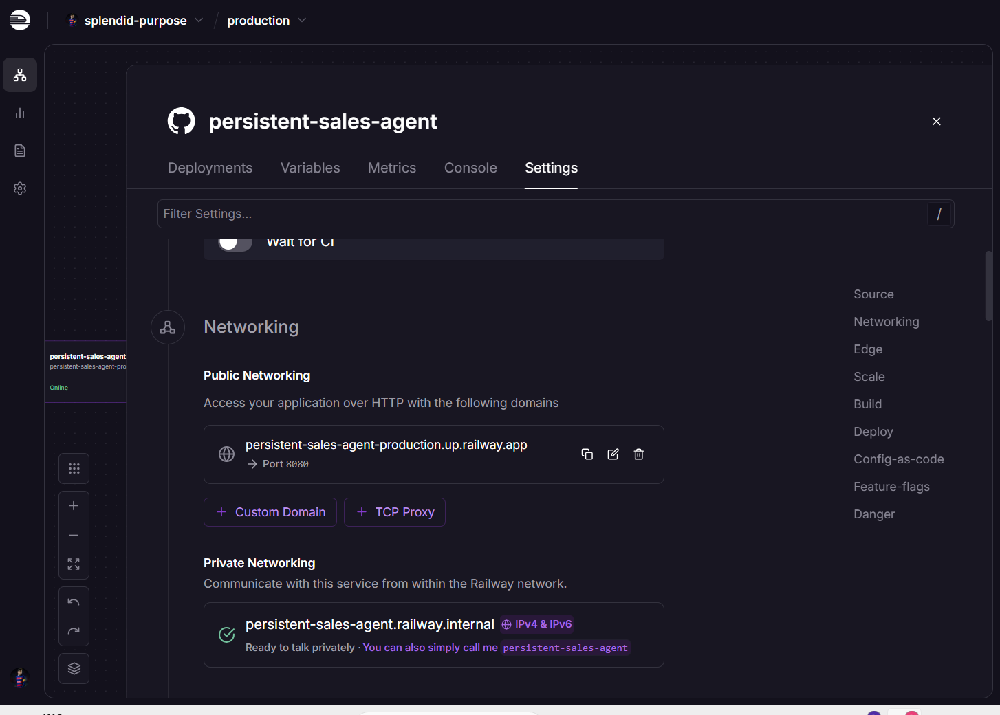
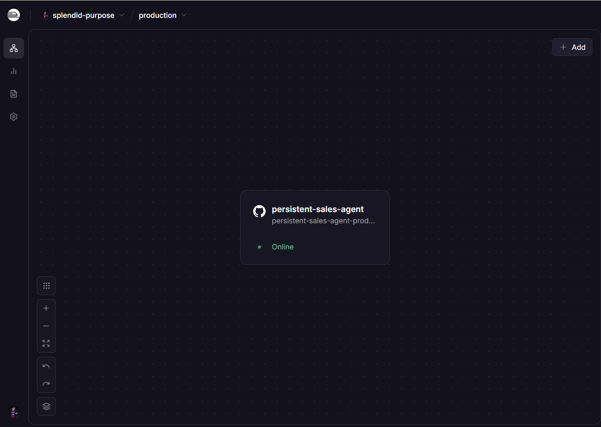
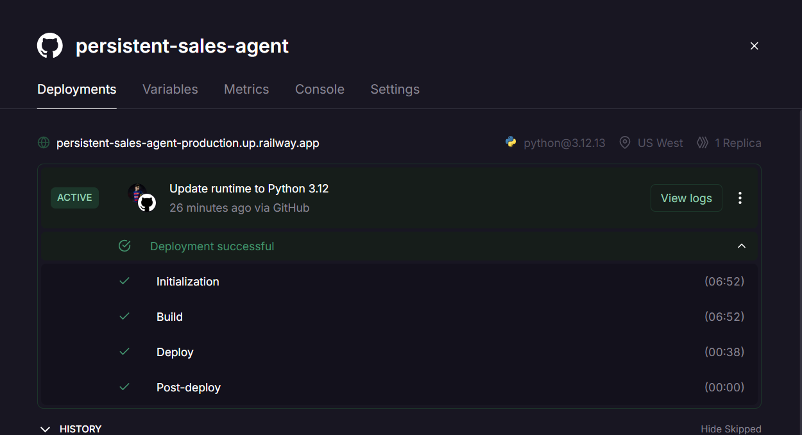
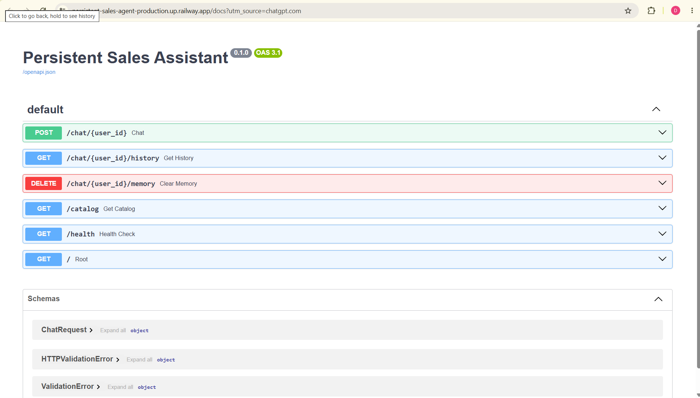
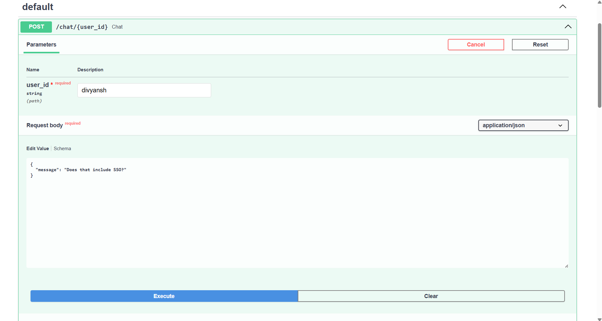
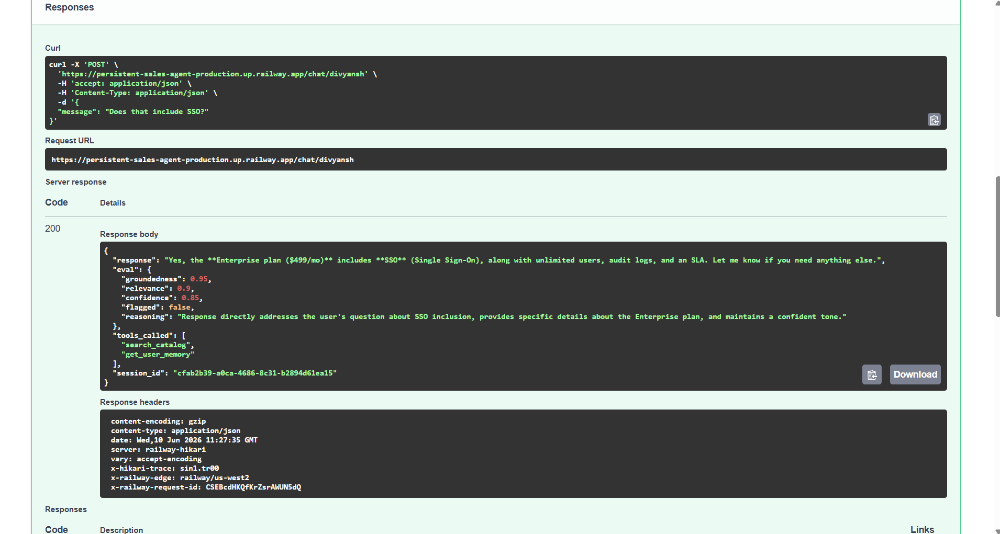
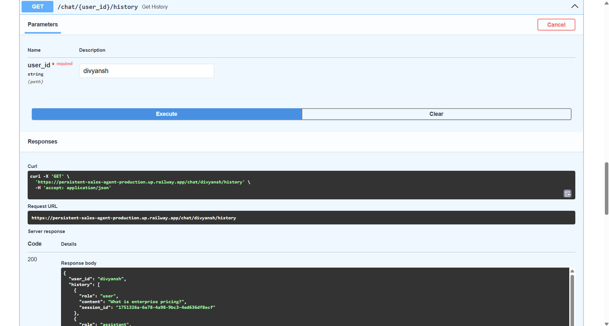
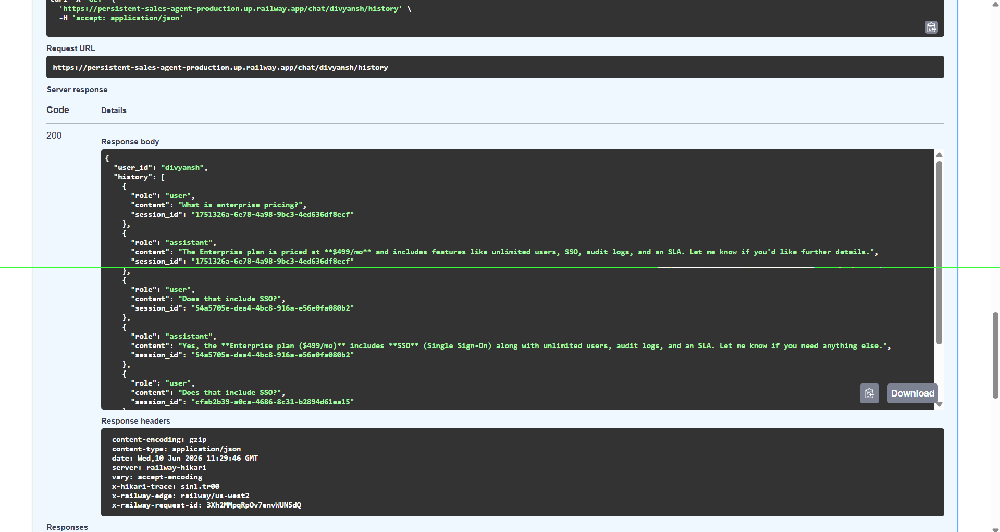

# Persistent Sales Assistant Agent

An AI-powered backend sales assistant built with FastAPI, OpenAI, SQLite, and Railway deployment.
This project demonstrates **persistent conversational memory**, **real tool usage**, and **LLM-based self evaluation** for production-style AI agents.

---

# Live Deployment

**Railway URL:**
`https://persistent-sales-agent-production.up.railway.app`

**Swagger Docs:**
`https://persistent-sales-agent-production.up.railway.app/docs`

---

# Features

* Persistent cross-session memory
* Tool-based AI agent architecture
* Product catalog search
* Self-evaluation scoring on every response
* SQLite-backed memory storage
* FastAPI REST API
* Railway cloud deployment
* Swagger/OpenAPI documentation

---

# API Endpoints

| Method | Endpoint                  | Description                   |
| ------ | ------------------------- | ----------------------------- |
| POST   | `/chat/{user_id}`         | Chat with persistent memory   |
| GET    | `/chat/{user_id}/history` | Retrieve conversation history |
| DELETE | `/chat/{user_id}/memory`  | Clear user memory             |
| GET    | `/catalog`                | View SaaS product catalog     |
| GET    | `/health`                 | Health check                  |

---

# Project Architecture

```text
User Request
      ↓
FastAPI Route
      ↓
Sales Agent
      ↓
Tool Calls
 ├── search_catalog()
 └── get_user_memory()
      ↓
LLM Response Generation
      ↓
Self Evaluation Agent
      ↓
SQLite Memory Storage
      ↓
Final JSON Response
```

---

# Folder Structure

```text
app/
│
├── api/                 # Route handlers
├── agents/              # Agent logic + evaluator
├── memory/              # Memory abstraction layer
├── tools/               # Tool implementations
├── db/                  # SQLAlchemy database models
├── models/              # Pydantic schemas
├── data/                # Product catalog JSON
└── main.py              # FastAPI app entry point
```

---

# Persistent Memory Design

The assistant stores all user interactions inside SQLite using SQLAlchemy models.

Why SQLite?

* Lightweight
* Easy local development
* Persistent across sessions
* Simple deployment

The memory layer is abstracted through:

```text
memory/base.py
memory/sqlite_memory.py
```

This makes it easy to swap SQLite with:

* PostgreSQL
* Redis
* Mem0
* Vector databases

without changing the agent logic.

---

# Tool Usage

The agent does not rely on hallucinated responses.

Instead, it uses real callable tools:

### `search_catalog(query)`

Searches the SaaS pricing catalog for relevant plans and features.

### `get_user_memory(user_id)`

Retrieves past user conversations from the database for contextual continuity.

### `flag_for_human(user_id, reason)` *(Bonus)*

Can be used to escalate low-confidence responses.

---

# Self Evaluation Design

Every response includes a structured evaluation block:

```json
"eval": {
  "groundedness": 0.95,
  "relevance": 0.90,
  "confidence": 0.85,
  "flagged": false,
  "reasoning": "Response directly answers the user's question using catalog and memory context."
}
```

The evaluator uses an LLM prompt-based scoring approach.

### Current Limitations

* Scores are self-reported by the LLM
* Not fully deterministic
* No external benchmark evaluator

### Production Improvements

At scale, this could be replaced with:

* DeepEval
* Ragas
* Human feedback pipelines
* Separate evaluation models
* Guardrails/monitoring systems

---

# Product Catalog

```json
{
  "plans": [
    {
      "name": "Starter",
      "price": "$49/mo",
      "features": ["5 users", "API access", "email support"]
    },
    {
      "name": "Growth",
      "price": "$199/mo",
      "features": ["25 users", "webhooks", "priority support"]
    },
    {
      "name": "Enterprise",
      "price": "$499/mo",
      "features": ["unlimited users", "SSO", "audit logs", "SLA"]
    }
  ]
}
```

---

# Cross-Session Memory Demo

## Call 1

```bash
curl -X POST "https://persistent-sales-agent-production.up.railway.app/chat/divyansh" -H "Content-Type: application/json" -d "{\"message\":\"What is enterprise pricing?\"}"
```

## Call 2

```bash
curl -X POST "https://persistent-sales-agent-production.up.railway.app/chat/divyansh" -H "Content-Type: application/json" -d "{\"message\":\"Does that include SSO?\"}"
```

The second response correctly remembers the previously discussed Enterprise plan without requiring it in the request body.

---

# Example Response

```json
{
  "response": "Yes, the Enterprise plan includes SSO along with audit logs and unlimited users.",
  "eval": {
    "groundedness": 0.95,
    "relevance": 0.90,
    "confidence": 0.85,
    "flagged": false,
    "reasoning": "Response uses catalog and previous user memory."
  },
  "tools_called": [
    "search_catalog",
    "get_user_memory"
  ],
  "session_id": "uuid"
}
```

---

# Local Setup

## Clone Repository

```bash
git clone https://github.com/Divyansh-git10/persistent-sales-agent.git
cd persistent-sales-agent
```

## Create Virtual Environment

```bash
python -m venv venv
venv\Scripts\activate
```

## Install Dependencies

```bash
pip install -r requirements.txt
```

## Add Environment Variables

Create a `.env` file:

```env
OPENAI_API_KEY=your_key_here
```

## Run Server

```bash
uvicorn app.main:app --reload
```

---

# Deployment

Deployed on Railway using:

* GitHub integration
* Procfile
* Python 3.12 runtime
* Environment variables

---

# Screenshots

## Railway Deployment







---

## Swagger API Docs



---

## Persistent Memory Demo





---

## History Endpoint






---

# Tech Stack

* FastAPI
* OpenAI API
* SQLite
* SQLAlchemy
* Pydantic
* Railway
* Uvicorn

---

# Future Improvements

* Vector memory retrieval
* Semantic search embeddings
* PostgreSQL production database
* Streaming responses
* Conversation summarization
* Human escalation dashboard
* Evaluation analytics endpoint

---

# Author

**Divyansh Gautam**
AI/ML Engineer | GenAI | RAG Systems | Agentic AI

GitHub:
`https://github.com/Divyansh-git10`
